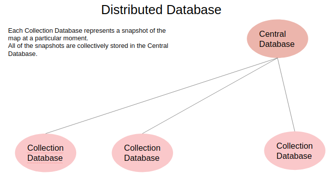
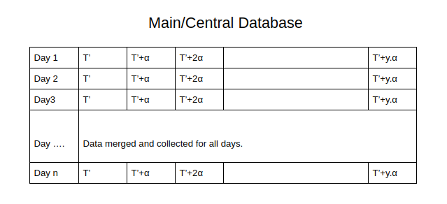
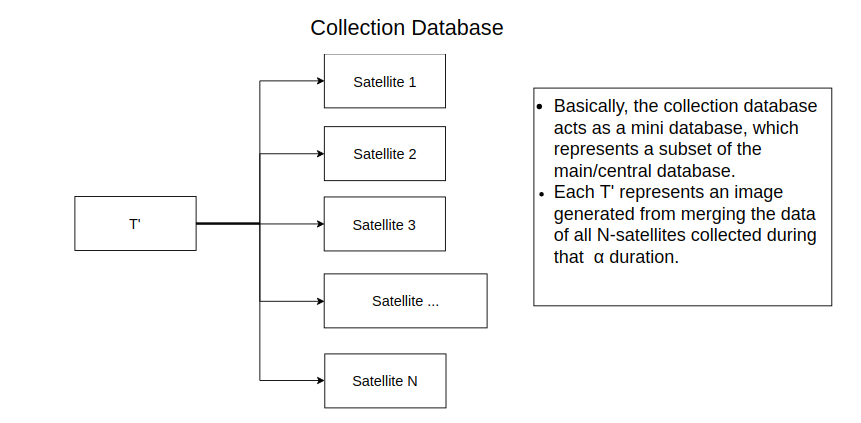

Direct Demod - Automatic NOAA Map and Globe Projection
======================================================

Combining Maps from Multiple DSGN Stations and Scrolling through Time
---------------------------------------------------------------------

### This project is for adding supplement files for the following [proposal](https://docs.google.com/document/d/1dH36BWyLU2bjtMudt8bBVoROjMZty47-XSv6j485FmY/edit?usp=sharing).

### Contents

This project aims to improve the current rendering of map and globe from DirectDemod python libraries, along with combining maps from different stations and being able to view data along a large time-zone.

The following issues are faced while rendering data from multiple record stations, combining and syncing them, along with rendering them -

*   **Large Data Set**  
    The data set to be represented for this project is very large. Having data from many satellites, and having many captures of data from each satellite per day, leads us to the problem of maintaining and handling large data sets. We have to cover obtaining data from DSGN stations, and their parallel processing using python script.
  
*   **Efficient Data Retrieval**  
    Efficient Data Retrieval from data-bases is also important for faster rendering of data into web-page. We have to design our database schema in such format, that we have both write and retieve operation as fast as possible, i.e.  
    1\. when processing data, we can store it efficiently  
    2\. accesing data for rendering  
    For this, we will use the concept of de-centralised NoSQL database. The schema is discussed below.
  
*   **Algorithm for merging and syncing of processed data**  
    As we are showing data through time, we will collect the data, over a large range of days, from many satellites.There is a good possibility that data from the satellites are captured at differnet timestamps, and we need to devise an algorithm, to sync and merge the data captured at different time.
  
*   **Merging of Different Data Sets**  
    The merge python code, as worked on during last summer, will need heavy modification, as now we are merging data-sets over an added parameter - time. Hence it is suggested that a new merging algorithm is developed from the existing work, to add new parameters.
  
*   **Time Scrolling**  
    Discussed as .gif format below.
  
*   **Increase Robustness**  
    A new data-format, offset variable is added to help improve the robustness of the webpage, and increase user flexibility.

### Project Details

*   **Obtaining SDR file from DSGN Station and parallely processing data**  
      
      
      
    This image clarifies the parallel processing of multiple singals from record stations, and storing it in JSON format in \*\*Collection database. This is done using \*\*misc.py.  
    
  
*   **Algorithm for merging and syncing of processed data**  
      
    For simplicity, we assume we have data from 2 satellites only.  
      
    For satellite-1:  
    Let us say the first SDR file recieved has data at timestamp 't1'.  
    Eg. t=0000hrs  
    It will now periodically capture data after every 'X1' time.  
    Eg. If X1=30 minutes, we have next snapshots at 0030hrs, 0100hrs, 0130hrs, and so on.  
      
    For satellite-2:  
    Let us say the first SDR file recieved has data at timestamp 't2'.  
    Eg. t=0010hrs  
    It will now periodically capture data after every 'X2' time.  
    Eg. If X2=30 minutes, we have next snapshots at 0040hrs, 0110hrs, 0140hrs, and so on.  
      
    We can't merge data from satellite-1 at any point of time, with satellite-2's data at any other point of time. We need a proper way of matching, and syncing signals to create an effective map. The proposed solution for this is -  
      
    For every fixed time period, let us say α time, a satellite would generate only 1 image which will show the average representation of data over that time period. (Multiple and no signals would be implemented during the coding part of the idea.)  
    Eg. α = 15 minutes.  
    Therefore, the map will show data at every 15 minutes, i.e. 0015hrs, 0030hrs, 0045hrs, and so on. Here,  
    0015hrs - Merging of satellite-1 (0000hrs data), and satellite-2 (0010hrs data)  
    0030hrs - Merging of satellite-1 (0030hrs data), and satellite-2 (0010hrs data)  
    0045hrs - Merging of satellite-1 (0030hrs data), and satellite-2 (0040hrs data)  
    The value of α would be kept to provide very accurate representation of data, and can be externally configured by user.  
    
  
*   **DataBase Schema & Merging of Database**  
      
    Till here, we can interpret that for which signals would be used to merge, and georeference to generate the map. Now we move to the database schema and representation.  
    For this purpose, we would be using a de-centralised NoSQL database, like MongoDB to efficiently perform the CRUD operations.  
      
      
      
    
    Consisting of 1 Central Database, and many Collection Databases.
    
      
      
      
      
    
    Here we are representing n-Days data in the Main Database.  
    α is our decided interval, at which we would be rendering data in a day.  
    Therefore, data is represented at the following intervals -  
    T’ , T’+α, T’+2α …..T’+yα , where y=(24/α) to represent total blocks in a day.
    
      
      
      
      
    
    Each T' represents a snapshot of the map at a particular time, made by merging all possible satellite signal data, during that 'α' period.
    
      
      
    
  
*   **Time Scrolling**  
      
      
      
    For representation purposes, a gif showing the spread of coronavirus in the world map, across a time range is used. A feature similar to this would be used for scrolling through the time.  
    
  
*   **Offset Parameter - Increasing Robustness and Flexibility**  
      
    A web-widget tool would be prepared (just the front end schema/skeleton portion) which would let users have more control over data from which satellite is to be rendered.